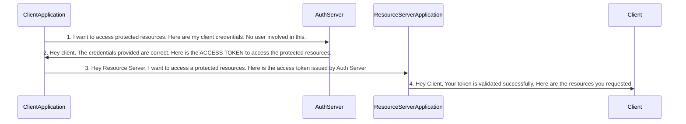

# OAuth2 Client Credentials

Client Credentials Grant Type flow implementation with Spring Security and KeyCloak.

## Technologies
- Java 17
- Maven
- Spring Boot
- Spring Security
- Spring Cloud OpenFeign
- OAuth2 Client (client applications)
- OAuth2 Resource Server (resource server application)
- [KeyCloak](https://www.keycloak.org/) - open source identity and access management solution. (Auth Server)

## Running the Application

1. Clone repository
```
git clone https://github.com/sevketbuyukdemir/oauth2-client-credentials.git
```
2. Run KeyCloak via Docker Desktop
- To create KeyCloak container for the first time.
```
docker-compose up -d
```
- To start the existing KeyCloak container
```
docker-compose start
```
- To stop the KeyCloak container
```
docker-compose stop
```
- To start from fresh point
```
docker-compose down -v
```
3. Run Spring Boot applications

> [!TIP]
> Most commonly used grant type flow in Microservices environment.

## Client Credentials Grant Type Flow:



> [!IMPORTANT]
> In the steps 1, where client is making a request to Auth Server endpoint have to send the below important details.
>
> - **client_id & client_secret:** the credentials of the client to authenticate itself.
> - **scope:** similar to authorities. Specifies level of access that client is requesting like READ.
> - **grant_type**: with the value "client_credentials" which identifies the kind of grant type is used.

> [!NOTE]
>
> - This is the simplest grant type flow in OAUTH2.
> - We use this authentication flow only if there is no user and UI involved. Like in the scenarios where 2 different applications want to share data between them using backend APIs.